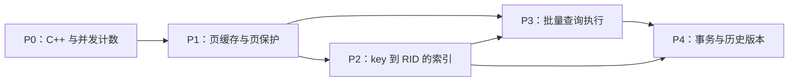

# BusTub 
## 1. 阅读入口

| 顺序 | 指导文档 | 完成后你应当能解释什么 |
| --- | --- | --- |
| 0 | [P0：Count-Min Sketch](project0-count-min-sketch.md) | 概率计数、移动语义、并发累加 |
| 1 | [P1：Buffer Pool Manager](project1-buffer-pool.md) | 内存页如何缓存、锁如何交接、页如何写回 |
| 2 | [P2：B+ 树索引](project2-b-plus-tree.md) | 路由、分裂、借位、合并、tombstone 和并发 |
| 3 | [P3：查询执行](project3-query-execution.md) | SQL 如何变成批量算子、连接、排序和窗口计算 |
| 4 | [P4：MVCC 并发控制](project4-mvcc.md) | 版本可见性、undo、冲突、回滚、GC 和验证 |

官方入口：[Fall 2025 Assignments](https://15445.courses.cs.cmu.edu/fall2025/assignments.html)。五个项目编号是 **0—4**，不是 1—5。

五个项目怎样接起来：



P0 主要训练编程基础；P1、P2、P3、P4 则逐层提供后续真正调用的组件。

## 2. 你目前的历史，能证明什么

以下“已有”指提交中存在实现；它不等于官方评分满分，也不等于所有边界正确。提交消息里的“通过”属于历史描述，只有本次重新执行的结果才是本次验证。

| 项目 | 可追溯提交 / 分支 | 本地代码中的实现与边界 |
| --- | --- | --- |
| P0 | `b257c80`、`0ff25b5` | CMS 基本 API 已实现；单 mutex 串行化 Insert，移动后哈希函数捕获原对象，需重新设计 |
| 额外练习 | `387b5ba`、`8ef6673`、`49aaf94` | SkipList；不是该学期 P0 必做主体，附在 P0 文末 |
| P1 | `04b5a32`、`015f201` | ARC、调度器、页保护和 BPM；ARC 的 MFU ghost 不对称分支遗漏，部分并发交接有风险 |
| P2 | `9740755` → `15188bc` → `0a5eb33` → `444d0c8` → `2124edf` | 页操作、树操作、迭代器和乐观路径；tombstone、内部页右借和锁升级需要重点复核 |
| P3 Task 1 | `4f1b87e` / `solution-task1`，主线练习 `670ee70`、`1951166` | 访问与修改执行器、扫描优化；最终主线已被 P4 的 MVCC 改写 |
| P3 Task 2 | `82b394b` / `solution-task2`，主线提示 `5670810` | 聚合、NLJ、索引连接；完整 Task 1/2 在 `2e9c834` 汇入主线 |
| P3 Task 3 | `fc7ee34` / `solution-task3` | 内存 Hash Join、NLJ 转 Hash Join；尚无 Grace 分区落盘 |
| P3 Task 4 | 后续 P4 提交中的排序 / LIMIT 支持 | LIMIT 已有；外部排序类实际全量内存排序；临时页 / run 迭代器 / 窗口函数未完成 |
| P4 | `908f553` → `80a8ac3` → `d96c1d5` → `ef110d3` | 时间戳、快照、MVCC 写入、回滚、GC、主键和可串行化验证均有实现与回归测试 |

还需区分课程与仓库：你的 CMS 骨架含 `@spring2026` 注释；P3 测试列表还留着其他版本的 Top-N 测试。不能仅按文件名判定本学期必做任务。文档采用 Fall 2025 的项目范围，具体 API 采用你的仓库，差异处单独说明。

## 3. 安全建立重做环境

本次仅增加文档，不改你的实现、不替你重置分支。你开始练习时，可以用下面命令创建独立工作树。`git worktree` 相当于“同一份 Git 历史的另一套文件目录”，不会把当前完成版覆盖掉。

在现有 `bustub-master` 目录执行：

```bash
git status --short
git rev-parse --show-toplevel
git show e7b2355:bustub-master/src/primer/count_min_sketch.cpp
repo_root=$(git rev-parse --show-toplevel)
git worktree add "${repo_root}-relearn" -b relearn-from-zero e7b2355
cd "${repo_root}-relearn/bustub-master"
```

这条历史中的 `e7b2355` 是你的项目起始代码，适合作为复习基线。注意真实 Git 根目录是 `CMU-DB_15445_Project`，BusTub 在子目录里，因此 `git show` 的历史文件路径需要 `bustub-master/` 前缀。新工作树位于原 Git 根目录的旁边。

若分支名或工作树路径已存在，改用新名字。不要运行 `reset --hard` 来“方便地回到起点”。也不要把最新版官方 master 直接合进来再照旧教程做：模板接口可能改变。

建议五个项目在这个重做分支上连续完成。每个阶段都提交一次，后一个项目自然使用前一个项目的实现。只想练 P4 时，另建以 `26ea632` 为基线的工作树；其中 P3 的不完整项仍需按 P3 文档处理。

## 4. 先学会这些 C++ 词语

| 词语 | 在这套项目里怎么理解 |
| --- | --- |
| `const` | 接口承诺不通过这个入口修改对象；不自动提供线程安全 |
| 引用 `T &` | 原对象的别名，常用来输出结果、避免复制 |
| `std::optional<T>` | “可能有一个 T”；空值与“有一个空 vector”不是一回事 |
| `std::move` | 允许移动资源，不自动移动、不自动清空所有成员 |
| `unique_ptr` | 一个所有者，转移后旧所有者失去资源 |
| `shared_ptr` | 共享生命周期；多个 shared_ptr 不保证被指向对象线程安全 |
| RAII | 把资源释放放到析构函数；离开作用域自动解锁 / unpin |
| mutex / latch | 保证短期共享结构访问互斥；区别于事务级隔离协议 |
| atomic | 单次访问可以原子化；多个字段间的一致性仍需另外设计 |
| lambda 捕获 | `[this]` 保存对象地址，移动 lambda 不会改掉该地址 |
| 模板实例化 | 模板写在 `.cpp` 时，需有相应类型的显式实例化，否则可能链接失败 |

每次遇到不熟悉的语法，先写一个十几行的小程序验证。把“语法不懂”与“数据库算法不懂”分开解决。

## 5. 构建、测试、提交的统一操作

以下命令均在你正在练习的 `bustub-master` 目录运行：

```bash
cmake -S . -B build -DCMAKE_BUILD_TYPE=Debug
cmake --build build --target count_min_sketch_test -j4
./build/test/count_min_sketch_test --gtest_list_tests
./build/test/count_min_sketch_test --gtest_filter='CountMinSketchTest.BasicTest1'
```

`-S` 指源代码目录，`-B` 指构建产物目录，`--target` 指本次要编译的目标，`-j4` 表示最多四个编译任务。编译器报错时，从日志中第一个有实际内容的 error 开始处理；末尾的 make 失败通常只是结果。

你的不少公开单元测试默认叫 `DISABLED_...`。**不要以“0 tests passed”当作成功。** 可以不用改测试文件，运行时加：

```bash
./build/test/arc_replacer_test --gtest_also_run_disabled_tests
```

查看项目检查目标和打包文件清单：

```bash
rg -n 'submit-p|check-clang-tidy-p|P[0-4]_FILES' CMakeLists.txt
cmake --build build --target check-format
cmake --build build --target check-lint
cmake --build build --target check-clang-tidy-p0
cmake --build build --target submit-p0
```

将 `p0` 换成相应编号。`format` 会修改源码，`check-format` 只检查。Debug 默认启用 ASan，Release 再检查一次，尤其防止把实际操作写进仅 Debug 执行的断言中。若启用 TSan 检查竞态，应建单独构建目录并采用独立 sanitizer 配置，不要与 ASan 混用。

不要从任意旧二进制推出当前源码正确；修改后先编译目标。公开测试通过只说明这些案例通过，仍需手册中的边界检查。

## 6. 每一步如何学习

每篇文档中的步骤按“准备 → 实现 → 手算 → 验收”推进。建议固定用以下循环：

1. 只读到当前步骤；用自己的话写出函数的输入、输出、状态变化。
2. 画一个最多五个元素的例子，把每个数组 / 链表 / 指针写出来。
3. 不看完成版，先写自己的实现。
4. 运行本步骤对应测试，失败时定位第一个违反的不变量。
5. 卡住时先读伪代码，再读相关提交的 diff，最后才看完成版函数。
6. 修正后记录“错误假设、触发输入、正确不变量”，然后提交。

查看历史，不必切分支：

```bash
git show --stat 015f201
git show 015f201 -- src/buffer/buffer_pool_manager.cpp
git diff solution-task1..solution-task2 -- src/execution
git diff p4-solution-task2..p4-solution-task3 -- src
```

`solution-task1` / `solution-task2` / `solution-task3` 属于 P3；`p4-solution-taskN` 属于 P4。它们是答案对照，不是逐步照抄的脚本。P4 文档还会指出为什么不能把 `main` 的访问执行器直接当成 P3 版本。

每完成一个项目，关掉文档，回答文末问题，再独立重写一个核心函数。第二遍减少伪代码依赖，第三遍只保留 API、测试和不变量清单。脱离帮助靠的是能解释和验证自己的代码，不是强迫自己一直不看资料。

## 7. 本次验证记录

本次复核结果见 [验证与代码边界记录](verification.md)。该记录明确区分实际运行、静态检查和历史声明。文档中的建议实现尚未替你写入源码，所以不能把建议章节理解为已经修复或已通过测试。
